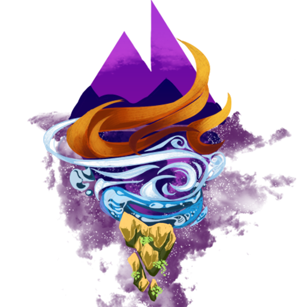

# PrimevalRPG



PrimevalRPG is a powerful Bukkit/Spigot plugin that transforms your Minecraft server into a full-fledged RPG experience. With custom items, mobs, abilities, scripting hooks, flags and region support, server administrators can craft unique adventures, quests, events and more—without touching a single line of core code!

---

## 🚀 Features

- **Custom Items**  
  Create and manage unique gear via `/pv item create <key>` or define entries in `custom-items.yml`.  
  • Customize material, display name, glow, lore, NBT data and more.

- **Custom Mobs**  
  Full support for user-defined monsters—either via the in-game GUI or directly in `mobs.yml`:  
  • Entity type, custom display name, level, health and attribute modifiers  
  • Weapons, armor, drop tables and loot-roll settings  
  • Attach mob abilities (e.g. Shockwave, LaunchUp or your own scripts)  
  • World-specific spawn rules (Overworld, Nether, End), spawn distances and caps

- **Player Abilities**  
  Define per-player skills that fire scripts on events (click, damage, movement, etc.) with optional conditions and cooldowns. Configured in `playerAbilities.yml`.

- **Mob Abilities**  
  Create reusable ability definitions in `abilities.yml` and assign them to any custom mob or item. Control timing, targets, effects and chained scripts.

- **Global Events & Scripting**  
  Use PrimevalRPG’s lightweight DSL to hook into any Bukkit event—block breaks, entity spawns, chat, you name it.  
  • Write conditions, cancel events, run commands, play sounds/particles, set flags, teleport, titles and more.

- **Flag Management**  
  Track persistent boolean flags per player or entity for quest lines, phase transitions, cooldown gates, one-offs and prestige systems. Accessible in Java or scripts via `flagSet`/`flagClear` and `hasFlag`.

- **Regions & Triggers**  
  Define named areas in `regions.yml` and fire scripts on enter/exit, interact, scheduled intervals or custom triggers.

- **Logging & Debugging**  
  Toggle debugMode for verbose output. Fine-grained logger levels and real-time reloads help diagnose configuration or script errors without downtime.

## 🛠️ Custom Event & Command API, Comming soon....

## Planned API Support

PrimevalRPG will expose the Command & Event Handle APIs so you can define your own triggers and in-game commands—then invoke them from any script or global event.

```java
private void buildCommandExecutionLogic() {
        ScriptCommandAPI.builder()
                .command("launchUp")
                .alias("launchUp", "soar")
                .execute(this::execLaunchUp);

        ScriptEventAPI.onEntityEvent(PrimevalRPG.getInstance(), 
                CreatureSpawnEvent.class, 
                List.of("actionbar text='§5The End Portal glows with cosmic energy…' @self"));
    }

private void execLaunchUp(ScriptCommand cmd, ScriptContext ctx) {
    double power = Double.parseDouble(
            cmd.args.getOrDefault("power", "1.0")
    );
    // apply vertical velocity
    ctx.self.setVelocity(new Vector(0, power, 0));
    // optional feedback
    ctx.self.sendMessage("↑ Launched with power=" + power);
}
```

### 1. ScriptEventAPI

Register a handler that fires a list of script lines whenever a Bukkit event occurs:

- The first argument is the Bukkit event class you want to listen for.
- The extractor function returns a `LivingEntity` to use as `@self`, or `null` to skip.
- The script lines run in a new `ScriptContext`, so you can use delay, flags, velocity, commands, etc.

### 2. ScriptCommandAPI

Dynamically define a new in-game “script command” that players or scripts can invoke:

- `builder(key)` starts a new command definition.
- `.arg(name, description)` declares named arguments.
- `.handler((ctx, cmd) -> {…})` is invoked when your command runs.
- `.register()` makes it available immediately—no plugin reload required.

### Invoking Custom Commands in Scripts

Once registered, you can call your new command from any script or YAML:

---

## 📦 Installation

1. Download the latest `PrimevalRPG.jar`.
2. Drop it into your server’s `plugins/` folder.
3. Start the server once to generate config files.
4. Customize generated `.yml` files to suit your world.
5. Restart or `/reload`.

---

## ⚙️ Configuration

All configuration lives in `plugins/PrimevalRPG/`.

## File Reference

- `config.yml`  
  Global plugin settings:
  • debugMode: enable verbose logging  
  • levelingEnable: toggle RPG leveling  
  • customMobsEnabled: allow natural custom mob spawns

- `custom-items.yml`  
  Definitions for custom items:
  • material, displayName, glow, lore, etc.

- `mobs.yml`  
  Custom‐mob spawn configuration:
  • spawningDistanceMin/Max, spawn chances, max per player  
  • definitions under `customMobs:`

- `player.yml`  
  Static player data:
  • XP gain rates (e.g. MOB_KILL_XP, BLOCK_BREAK_XP)

- `flags.yml`  
  Persistent flag store (auto‐generated):
  • UUID-keyed lists of flag names for quests, phases, one‐offs

- `globalEvents.yml`  
  Server-wide event hooks:
  • match any Bukkit event, apply conditions, run script actions

- `playerAbilities.yml`  
  Per-player abilities:
  • event triggers, optional condition, cooldown, and script actions

- `abilities.yml`  
  Shared ability definitions:
  • attach to mobs, specify timing, targets and scripts

- `regions.yml`  
  Named area definitions:
  • region boundaries, event hooks or scheduled scripts

---

## 🛡️ Commands & Usage

Use the `/primeval` root command to access all plugin features. Run `/primeval help` in-game for full details.

### Item Management
- `/primeval item create <key>`  
  Launch an interactive wizard to define a new custom item (saved to `custom-items.yml`).
- `/primeval item give <ItemUnquieID>`  
    Gives the target item to the command executor

### Configuration
- `/primeval reload`  
  Reload all configuration files (config, mobs, abilities, regions, flags…) without restarting the server.

### GUIs
- `/primeval playergui`  
  Open the Player Data & Stats menu.
- `/primeval coregui`  
  Open the main plugin configuration menu.
- `/primeval mobgui`  
  Open the Custom Mob browser and spawn menu.

### Server Info & Debug
- `/primeval entitycount`  
  Show the current count of active custom entities.

### Region Data
- `/primeval region <subcommand>`  
  Create named regions via command arguments.

### Player & Mob Control
- `/primeval level <player> <level>`  
  Set a player’s overall RPG level.
- `/primeval levelxp <element> <player> <xp>`  
  Adjust a player’s current target elemental XP.
- `/primeval playerattributess <player>`  
  Reset all attribute modifiers for a player.
- `/primeval spawncustom <mobKey> [count]`  
  Spawn one or more instances of a custom mob.

---

## ⚙️ Script Configuration

All configuration lives in `plugins/PrimevalRPG/`.

## ⏱️ Timing (Ticks)

Minecraft runs at 20 ticks per second. All timing parameters below (cooldowns, delays, effect durations, etc.) are expressed in ticks.

```yaml
# TIMING (TICKS):
# 0.5 seconds = 10 ticks
# 1 second = 20 ticks
# 5 seconds = 100 ticks

```
---

## ⚙️ Built-in Script Commands

| Command          | Aliases | Description                                 | Arguments                                                                                                     |
|------------------|---------|---------------------------------------------|---------------------------------------------------------------------------------------------------------------|
| lightning        | —       | Strike lightning at each target             | none                                                                                                          |
| lightning_safe   | —       | Strike lightning without block damage       | none                                                                                                          |
| fireball         | —       | Launch a fireball                           | direction=<forward\|towards\|away>, speed=<double>                                                            |
| ignite           | —       | Ignite the entity                           | duration=<ticks>                                                                                              |
| invulnerable     | —       | Make targets invulnerable                   | duration=<ticks>                                                                                              |
| sound            | —       | Play a sound                                | name=<SoundName>, volume=<float>, pitch=<float>                                                               |
| teleport         | —       | Teleport caster or targets                  | location=<@key\|x,y,z>, offsetX=<double>, offsetY=<double>, offsetZ=<double>                                  |
| particle         | —       | Spawn particles around targets              | name=<ParticleName>, count=<int>, radius=<double>                                                             |
| heal             | —       | Restore health                              | amount=<double>                                                                                               |
| effect           | —       | Apply a potion effect                       | type=<PotionEffectType>, duration=<ticks>, amplifier=<int>                                                    |
| knockback        | —       | Push or pull targets                        | strength=<double>, direction=<away\|towards>, x=<double>, y=<double>, z=<double>                              |
| setblock         | —       | Place or remove blocks in a shape           | type=<Material>, shape=<single\|cube\|sphere>, radius=<int>, location=<@key\|coords>, x, y, z, world=<String> |
| velocity         | —       | Set velocity vector                         | x=<double>, y=<double>, z=<double>                                                                            |
| damage           | —       | Deal damage                                 | amount=<double>                                                                                               |
| shockwave        | —       | Spawn a block-type shockwave                | type=<Material,…>, innerRadius=<double>, radius=<double>, speed=<double>, height=<double>, delay=<ticks>      |
| spawn            | —       | Spawn new entities                          | type=<EntityType>, location=<@key\|coords>                                                                    |
| world_time       | —       | Set the world time                          | time=<day\|night\|long>                                                                                       |
| weather          | —       | Change world weather                        | type=<clear\|rain\|thunder>                                                                                   |
| drop_item        | —       | Drop a custom item                          | item=<Material>, amount=<int>, displayName=<String>, clear=<bool>, lore=<String,…>, glow=<bool>               |
| invisibility     | —       | Grant invisibility                          | duration=<ticks>                                                                                              |
| title            | —       | Display a large title & subtitle            | title=<String>, subtitle=<String>, fadeIn=<ticks>, stay=<ticks>, fadeOut=<ticks>                              |
| actionbar        | —       | Send a one-line actionbar message           | text=<String>                                                                                                 |
| attribute        | —       | Modify a vanilla attribute                  | name=<AttributeName>, amount=<double>, operation=<ADD_NUMBER\|MULTIPLY_SCALAR_1\|MULTIPLY_SCALAR_2>           |
| clearEffects     | —       | Remove potion effects                       | type=<PotionEffectType> (omit to clear all)                                                                   |
| fallingblock     | —       | Create falling blocks                       | type=<Material>, location=<@key>, dropItem=<bool>, gravity=<bool>, velocity=<x,y,z>                           |
| flagSet          | —       | Set a custom boolean flag                   | name=<String>, targets=<@self\|@nearby,…>                                                                     |
| flagClear        | —       | Clear a custom boolean flag                 | name=<String>, targets=<@self\|@nearby,…>                                                                     |
| cancelEvent      | —       | Cancel the current Bukkit event             | none                                                                                                          |
| eventWave        | —       | Spawn successive waves of entities          | type=<EntityType>, count=<int>, radius=<double>, delay=<ticks>, rounds=<int>                                  |
| repeat           | —       | Repeat a sub-command                        | count=<int>, delay=<ticks>, action="<full command>"                                                           |
| message          | —       | Send chat messages to targets               | text=<String> (supports color codes)                                                                          |
| condition        | —       | Branch execution on a test                  | if=<expression>, then=<sub-command>, else=<sub-command>                                                       |
| orbit            | orbital | Spin entities around a focal point          | targets=<…>, radius=<double>, speed=<double>                                                                  |
| launchUp         | soar    | Blast targets skyward                       | targets=<…>, height=<double>                                                                                  |
| delay            | —       | Pause the script execution                  | ticks=<int>, then=&lt;sub-command&gt; (optional)                                                              |
| runCommand       | —       | Execute a command as if the caster typed it | targets=&lt;@self\|@nearby\|…&gt;, command="&lt;full command&gt;"                                             |
---

## 🔑 Keys & @Key Calls

The scripting engine supports two main kinds of “keys”:

1. **Target Keys** – shorthand for selecting which entities a command should affect.
2. **Interpolation Keys** – call‐style tokens you can embed in messages, conditions or layouts to pull in dynamic data.

---

### 1) Target Keys

Use these in your `targets=` argument (or wherever a list of entities is accepted):

| Key                                           | Meaning                                                         |
|-----------------------------------------------|-----------------------------------------------------------------|
| @self                                         | The caster or “current” entity                                  |
| @attacker                                     | Entity that caused the trigger (e.g. damager in a damage event) |
| @killer                                       | Killer in a death event                                         |
| @nearby                                       | All entities within default radius (16 blocks)                  |
| @nearby[<r>]                                  | All entities within radius r                                    |
| @nearbyPlayers                                | All players within default radius                               |
| @nearbyPlayers[<r>]                           | Players within radius r                                         |
| @nearest                                      | Single closest entity                                           |
| @nearestPlayer                                | Single closest player                                           |
| @nearestPlayer[<r>]                           | Closest player within radius r                                  |
| @allEntities                                  | Every entity in the world                                       |
| @allPlayers                                   | Every player in the world                                       |
| @allMobs                                      | Every non‐player mob in the world                               |
| @nearby[<r>][filters]<br>@allPlayers[filters] | Entities matching advanced filters (see below)                  |


**Advanced Filtering**  
You can append one or more comma-separated filters inside `[...]` to any of the above keys. Supported filter expressions:

• `type=ENTITY_TYPE` (e.g. `type=CREEPER`)  
• `health<value`, `health>value`, `health=value`  
• `level<value`, `level>value`, `level=value` (players only)

````yaml
targets=@nearby[type=ZOMBIE] 
# only zombies within 16 blocks targets=@nearby[10,health<5] 
# low‐health entities within 10 blocks targets=@allPlayers[level>=20] 
# all players of level 20 or higher
````

**Notes:**
- If you don’t explicitly include `@self`, the caster is automatically excluded from results.
- Radius syntax `[<r>]` accepts any numeric value (blocks).

---

### 2) Singleton‐Style Interpolation Tokens

Embed these in any string (e.g. `message text=…`, title/subtitle, layouts). They resolve to a single value.

| Token                           | Returns                                             |
|---------------------------------|-----------------------------------------------------|
| @self.getName()                 | Name of the caster                                  |
| @self.health()                  | Current health (e.g. 12.5)                          |
| @self.maxHealth()               | Max health                                          |
| @self.healthPercent()           | Integer percent of health                           |
| @self.x(), @self.y(), @self.z() | Block‐coordinate position                           |
| @self.world()                   | World name                                          |
| @self.facingX(), Y(), Z()       | Unit vector of look direction                       |
| @self.flag(NAME)                | “true”/“false” if custom boolean flag `NAME` is set |
| @attacker.getName(), …          | Same calls on the damager (only in damage events)   |
| @nearest.getName(), …           | Same calls on the nearest entity                    |
| @killer.getName(), …            | Same calls on the killer (in death events)          |
| @world.name()                   | Name of the current world                           |
| @world.time()                   | Current world time (in ticks)                       |
| @server.onlineCount()           | Number of players currently online                  |
| @server.maxPlayers()            | Configured maximum player slots                     |
| @server.tps()                   | Current server ticks‐per‐second                     |

---

### 3) Collection‐Style Interpolation Tokens

These resolve to aggregate data from a set:

| Token                      | Returns                                           |
|----------------------------|---------------------------------------------------|
| @nearbyPlayers.size()      | Number of nearby players                          |
| @allEntities.size()        | Total entities                                    |
| @allPlayers.size()         | Total players                                     |
| @allMobs.size()            | Total mobs                                        |
| @allEntities.names()       | Comma-joined list of all entity names             |
| @allPlayers.names()        | Comma-joined list of all player names             |
| @allMobs.names()           | Comma-joined list of all mob names                |
| @allPlayers.randomName()   | A random player’s name                            |
| @allMobs.randomName()      | A random mob’s name                               |

---

### 4) Numeric Variables (in expressions/conditions)

You can also use numeric tokens in conditional checks:

- @self.health(), @self.maxHealth(), @self.x(), @self.y(), @self.z()
- @world.time  (current world time)
- @nearbyPlayers.size(), @allEntities.size()

---

### 5) Example: Implementing Singleton Tokens

```yaml
      - >-
        condition if='!(@nearbyPlayers.size() == 0)'
        then='message text="Player(s) detected: @nearbyPlayers.size()" @nearbyPlayers[20]'
        else='message text="No players in sight." @nearbyPlayers[20]'

      - >-
        condition if='@self.health() < 10'
        then='message text="§cHelp! I''m almost dead!" @nearbyPlayers[20]'
        else='message text="§aI''m fine for now." @nearbyPlayers[20]'
```

---

## 🚩 Flag Management

Use flags to track arbitrary boolean states for players or entities—perfect for quest progress, phase transitions, cooldown gates and one-time events. Flags persist across restarts in `plugins/PrimevalRPG/flags.yml` under:


### Script DSL Commands

Two built-in script executors hook into the FlagManager:

```java
executors.put("flagSet", this::execFlagSet); 
executors.put("flagClear", this::execFlagClear);
```


- `flagSet name=<flag> @<target>`  
  Adds `<flag>` to the target’s flag list if not already present.
- `flagClear name=<flag> @<target>`  
  Removes `<flag>` from the target’s flag list if present.

### Example Usage in a Boss Script

```yaml
NetherGatekeeper: 
    cooldown: 200 
    script: 
    # 1) Enter Phase 2 when HP ≤ 50% and not already in Phase 2 
      - "on EntityDamageEvent: condition if='@self.healthPercent() <= 50 && !@self.flag(phase2)' flagSet name=phase2 @self" 
      - # 2) Only cast Blaze waves once phase2 is active 
      - "on EntityDamageEvent: condition if='@self.flag(phase2)' eventWave type=BLAZE count=3 radius=4 delay=30 rounds=5 @self" 
      - # 3) When the boss dies, mark the killer as having defeated it 
      - "on EntityDeathEvent: flagSet name=beatNetherGatekeeper @killer"
```

Later, you can check `hasFlag("beatNetherGatekeeper")` in scripts

---

## ✨ Sample Scripts

### Custom Mob Ability Example (abilities.yml)

```yaml
  hulk_jump:
    cooldown: 300
    script:
      # Slow falling for 6s → 120 ticks
      - "effect type=SLOW_FALLING duration=120 amplifier=1 @self"
      - "effect type=LEVITATION  duration=7 amplifier=17 @self"
      # Knock nearby entities away (within 10 blocks)
      - "knockback direction=away strength=2.5 @nearby[10]"
      # Play explosion sound at your location
      - "effect type=LEVITATION duration=5 amplifier=15 @nearbyplayers[15]"
      - "sound name=ENTITY_GENERIC_EXPLODE volume=1.0 pitch=1.0 @nearby"
      # Create a shockwave of block-crack particles around nearby players
      - 'repeat count=5 delay=5 action="particle name=BLOCK_CRACK data=DIRT count=10 @nearbyPlayers[10]"'
      - 'shockwave type=DIRT,STONE innerRadius=0.25 radius=5 speed=0.5 height=0.5 delay=7 @self'
      - 'repeat count=1 delay=40 action="damage amount=15 @nearby[30]'
      - "effect type=SLOW duration=120 amplifier=2 @nearbyPlayers[30]"
      - "on EntityDeathEvent: lightning_safe @self"
      - "on EntityDeathEvent: drop_item item=EMERALD displayName='§aEarth Gem' lores='Essence of Gia' amount=1 clear=true glow=true @self"
```

### Player Ability Example (playerAbilities.yml

```yaml
# 5) Gust Push – Wind
gust-push:
  type: Wind
  requiredLevel: 5
  event: PlayerInteractEvent
  condition: "action:RIGHT_CLICK_AIR"
  cooldown: 5
  script:
    - "particle name=CLOUD count=50 radius=4 @nearby"
    - "sound name=ENTITY_ENDERMAN_TELEPORT volume=1.0 pitch=1.0 @self"
    - "shockwave type=LEAF_LITTER innerRadius=0.5 radius=8 speed=2 height=1 delay=0"
    - 'shockwave type=DIRT,STONE innerRadius=0.25 radius=5 speed=0.5 height=0.5 delay=7 @self'
    - "knockback strength=2 direction=away @nearby[16]"
    - "effect type=LEVITATION duration=10 amplifier=2 @nearby[16]"
    - "effect type=SLOW duration=60 amplifier=1 @nearby[16]"
```

### Global Event Example (globalEvents.yml)

```yaml
compass-launch:
  event: PlayerInteractEvent
  condition: "item:compass & itemMeta:itemId=Test & action:RIGHT_CLICK_BLOCK | action:RIGHT_CLICK_AIR"
  cancel: false
  script:
    - "message text='Sky launch engaged!' @self"
    - "velocity x=0.0 y=2.5 z=0.0 @self"
    - "sound name=ENTITY_FIREWORK_ROCKET_LAUNCH volume=1.0 pitch=1.0 @self"
  
# 5) Every 300 ticks remind anyone holding coal to stoke their furnaces
furnace-reminder:
  interval: 300
  condition: "item:COAL"
  script:
    - "sound name=ENTITY_EXPERIENCE_ORB_PICKUP volume=0.8 pitch=1.2 @self"
    - "actionbar text='Keep that furnace burning!' @self"
    - "title title='' subtitle='Don’t run out of fuel!' fadeIn=5 stay=30 fadeOut=5 @self"
```

---

## 👥 Permissions

- `primeval.admin` — full access
- `primeval.default` — base access

Customize via your favorite permissions plugin.

---

## 📖 Examples

1. **Boss Room Trigger**  
   Define a region that starts a boss fight when a player enters.
2. **Treasure Hunt**  
   Use flags and script events to guide players through clues.
3. **Custom Dungeon**  
   Spawn waves of level-scaled mobs, grant loot tables on clear.

Full examples are available in the `examples/` folder.

---

## 🤝 Contributing

I welcome pull requests, bug reports and feature ideas!  
Please fork the repo, create a branch and submit via GitHub.

If you like the work I do and would like to be involved in potential tests, events or just keep up to date with the status of the plugin, head over to my [patreon](https://www.patreon.com/DraconicKnight)

---

## 📬 Support

Open an issue on GitHub for help and discussion.

---

**Author**: DraconicKnights/Dragonoid.  
Elevate your server—make every world an epic adventure!
